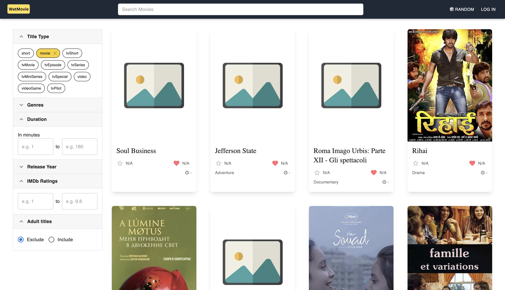

# WatMovie

## Description

Our application, WatMovie, is a database-driven platform that allows users to explore movies. We plan to utilize the publicly available IMDb Datasets. The platform is designed for movie enthusiasts who want to discover new films, find information about their favorite movies and keep track of what they’re watching currently.

## Steps to run the application

### Step 1: Clone the repository

```bash
git clone https://github.com/CS-348-Group-10/WatMovie.git
```

### Step 2: Install dependencies

```bash
cd WatMovie
npm install
```

### Step 3: Setup the database

1. Create a new docker container for PostgreSQL. This will create a new container with the name `watmovie-postgres` and the user `watmovie` with the password `watmovie`, and the default database `postgres`.

    ```bash
    docker pull postgres
    docker run --name watmovie-postgres -e POSTGRES_USER=watmovie -e POSTGRES_PASSWORD=watmovie -p 5432:5432 -d postgres
    ```

2. Add the following environment variables to the `.env` file:

    ```bash
    DB_USER=watmovie
    DB_HOST=localhost
    DB_NAME=postgres
    DB_PASSWORD=watmovie
    DB_PORT=5432
    NEXT_PUBLIC_POSTER_API_KEY=8180dbba
    ```

3. Download the appropriate datasets from IMDb

    Navigate to `https://datasets.imdbws.com/` and download the following 4 tsv files:
    - title.basics.tsv.gz [rename this to `title.tsv`]
    - name.basics.tsv.gz
    - title.principals.tsv.gz
    - title.ratings.tsv.gz

    Move these 4 tsv files to the `public` folder.

4. Run the server to create the database schema.

    ```bash
    npm run dev
    ```

    Next, we need to send an empty POST request to `http://localhost:3000/api/dev/runMigrations` to create the database schema.

5. Populate the database

- **To load the sample database:**
    
    Send an empty POST request to 
    
    `http://localhost:3000/api/dev/populateDatabase` 
    
    to populate the database with the sample data.

- **To load the production dataset:**
    
    In the above POST request, set the query parameter `isProduction=true` i.e. send an empty POST request to 
    
    `http://localhost:3000/api/dev/populateDatabase?isProduction=true` 
    
    to populate the database with the production dataset.

### Step 4: Open the application

Check the application by opening the `http://localhost:3000` in your browser. You can see the following page:



## List of Supported Features
1. **Title Browsing:**

    Browse and filter movies, TV shows, and titles by genre, type, duration, and release year with pagination support.

2. **Random Title Selection**

    Discover new movies with a random title generator from the database.

3. **Detailed Description Page**

    View in-depth title details, including cast information, on a dedicated page.

4. **Watchlist**

    Save and manage a personal watchlist for current and future viewing.

5. **User Reviews**

    Rate and review movies independently of IMDb to share opinions and guide others.